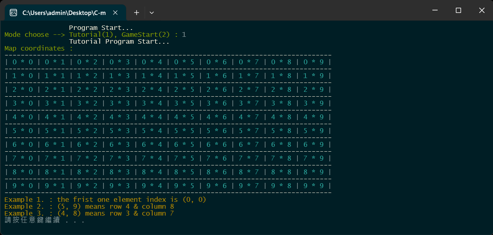
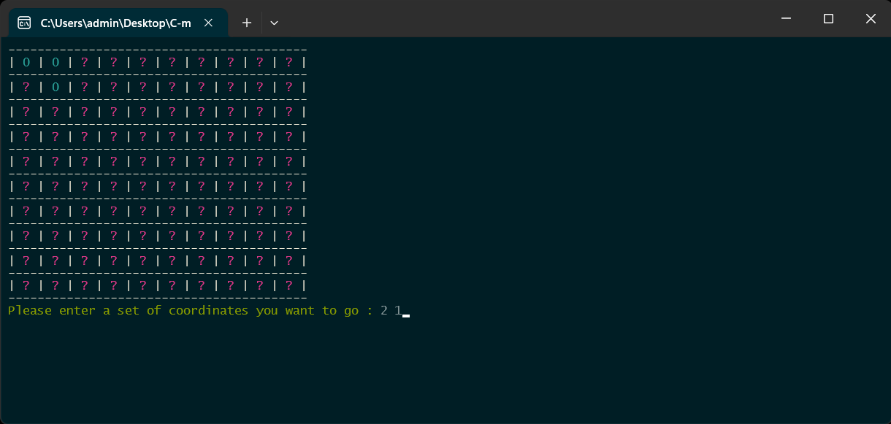
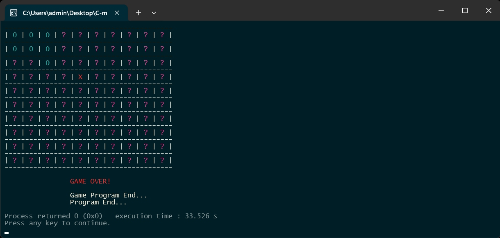

# 踩地雷遊戲
# Minesweeper Game

使用 `C` 語言實作**踩地雷**遊戲。  
Using `C` to implement Minesweeper game.   
  
> 2024/05/02 啟用維護，參見[日誌](#日誌)。

- #### 範例圖片
<div align = "center"></div>
<div align = "center"></div>
<div align = "center"></div>

- #### 範例影片
    - [運用 C 語言實作踩地雷遊戲 遊戲講解](https://youtu.be/R-RsgfPoEAA)
    - [運用 C 語言實作「踩地雷」遊戲 遊戲專題講解（程式執行片段）](https://youtu.be/M7gFYe0urUU)
    - [Making Minesweeper Game by using C language](https://youtu.be/88AM39bzVXA)

---

## 目錄
- [目錄](#目錄)
- [開發環境](#開發環境)
- [如何執行](#如何執行)
- [版本差異](#版本差異)
- [日誌](#日誌)
- [貢獻](#貢獻)
- [著作權](#著作權)

---

## 開發環境

- Windows Home 10 64bit
- `gcc 6.3.0` (MinGW.org GCC-6.3.0-1)
- DevC++
- CodeBlocks 17.12
- `C99`

---

## 如何執行

> 預設 ***Windows Home 10 64bit*** 作業系統  

- 方法一：直接點兩下執行 `minesweeper.exe`

- 方法二：在本地直接使用 `gcc` 編譯 `minesweeper.c` 

```bash
gcc -o minesweeper.exe minesweeper.c
```
```bash
minesweeper.exe
```

## 版本差異

| 版本 | 描述 |
| :--: | ---- |
| v1.0 | 現階段已完成。 |

## 日誌

| 時間 | 事件 |
| :--: | ---- |
| 2024/05/02 | 資料救援回復 **2022** 編輯紀錄，重新開始維護！ |

## 貢獻

獨立開發，這個專題蠻簡單的。

## 著作權

此專案受到 [GPL-3.0](https://www.gnu.org/licenses/gpl-3.0.zh-tw.html) 保障。  
Copyright © 2022-2024 zong zong ( zongzong0408 )
